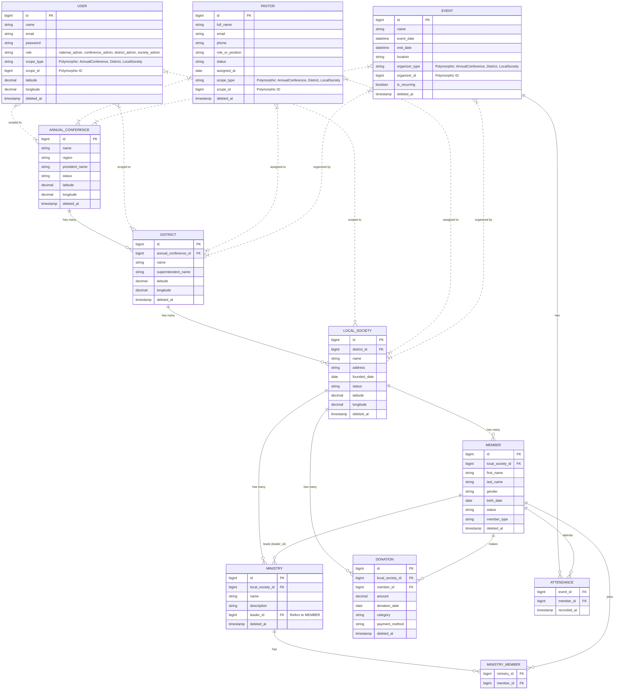

# Church System - Entity Relationship Diagram (ERD)

This document provides a comprehensive overview of the Church System's database architecture. The system relies heavily on a deeply nested organizational hierarchy, combined with polymorphic relationships to efficiently scope users, leaders, and events to their respective hierarchical levels.

## Entity Relationship Diagram (Mermaid)

## Explanation of the Architecture

### 1. The Core Hierarchy (The Backbone)
The system is built upon a rigid 3-tier organizational structure:
*   **Annual Conference**: The highest organizational tier.
*   **District**: A subdivision of an Annual Conference.
*   **Local Society**: The local church entity. It belongs to a District.
Most raw data (Members, Ministries, Donations) is explicitly tied to the `LOCAL_SOCIETY` via standard foreign keys (`local_society_id`).

### 2. Polymorphic Relationships (Scoping & RBAC)
To prevent massive duplication and complex pivot tables, the system leverages Laravel's polymorphic relationships (`morphTo`) for entities that can belong to *any* level of the hierarchy:
*   **Users (RBAC)**: An administrator uses `scope_type` and `scope_id` to determine their jurisdiction. A District Admin will have a `scope_type` of `App\Models\District` and the ID of their specific district. This dictates what data they can see.
*   **Pastors**: A pastor isn't strictly tied to a local church. A pastor can be assigned to a District (e.g., District Superintendent) or an Annual Conference. `scope_type` handles this cleanly.
*   **Events**: Events can be hosted by a local church (Youth Service), a District (District Convention), or a Conference (Annual General Assembly). `organizer_type` tracks exactly which hierarchical level owns the event.

### 3. Many-to-Many Relationships
*   **Ministry Members**: The `ministry_member` table allows a `Member` to join multiple `Ministries`, and a `Ministry` to hold multiple `Members`.
*   **Attendance**: The `attendance` table bridges `Members` and `Events`, allowing the system to track who showed up to which event, regardless of which hierarchical level organized the event.

### 4. Soft Deletes (The Archive)
Every primary entity in the system utilizes the `deleted_at` timestamp. When a record is deleted, it is not erased from the database but instead hidden from normal queries. The `ArchiveController` leverages this to populate the System Archive container, allowing administrators to safely restore data.

### 5. Geographical Mapping
The hierarchy entities (`AnnualConference`, `District`, `LocalSociety`) and the `User` table (specifically for National Admins) share `latitude`, `longitude`, and `location_name` columns. This allows the Church Map UI to plot nodes on the Leaflet map and establish a physical, geographical representation of the church's footprint.
